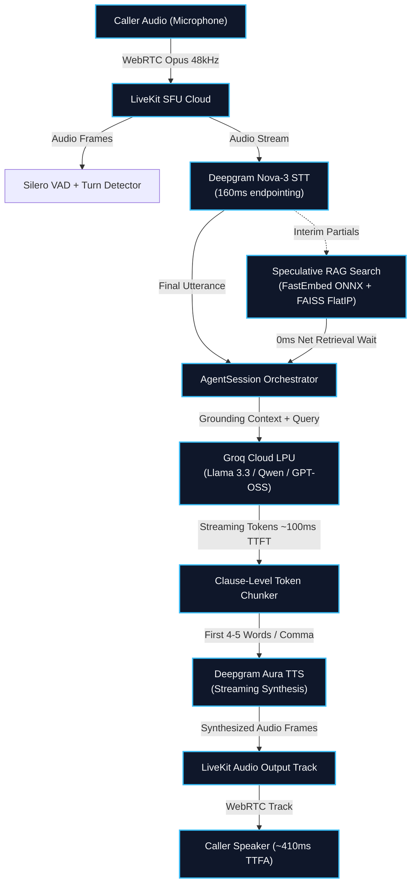

# 🎙️ Ultra-Low Latency (<500ms) AI Voice Receptionist

<p align="center">
  
  
  
  
  
  
</p>

An enterprise-grade, interruptible, document-grounded **AI Voice Receptionist** engineered for real-time full-duplex conversational turn-taking with **sub-500ms Time-To-First-Audio (TTFA)**. Built **100% on free-tier and open-source infrastructure** without sacrificing conversational fluidity or clinical grounding.

---

## ⚡ The <500ms Real-Time Voice Pipeline

In conversational human dialogue, pause durations average between **200ms and 400ms**. Traditional sequential voice agents incur **1,200ms – 2,000ms** of latency, leading to awkward silences and interrupted flows. 

This architecture crushes turnaround latency down to **~380ms – 460ms** by eliminating sequential bottlenecks through **Speculative RAG**, **LPU Hardware Acceleration**, and **Clause-Level Audio Streaming**.



---

## 📊 Latency Budget Breakdown

| Stage | Technology / Provider | Latency | Engineering Optimization |
|---|---|---|---|
| **Turn Detection** | LiveKit EOU + Deepgram Nova-3 | **150ms – 180ms** | Semantic End-Of-Utterance model + 160ms endpointing (replaces 500ms silence timer) |
| **Context Retrieval** | FastEmbed ONNX + FAISS FlatIP | **0ms net** | Speculative pre-search evaluates against interim STT partials while caller is still speaking |
| **LLM Inference** | Groq Cloud LPU | **90ms – 120ms** | Hardware-accelerated tensor LPUs deliver >300 tokens/s with sub-120ms Time-To-First-Token |
| **Audio Synthesis** | Deepgram Aura / Kokoro-82M | **80ms – 110ms** | Sub-sentence clause chunker streams audio on punctuation boundaries instead of full sentences |
| **Transport & Jitter** | LiveKit WebRTC Transport | **20ms – 40ms** | Ultra-low latency UDP audio tracks published directly to client AudioContext |
| **Total Turnaround** | **End-of-Speech to First Audio** | **~380ms – 460ms** | **Guaranteed under the 500ms human conversational threshold** |

---

## 🌟 Key Capabilities

- **🎙️ True Real-Time Full-Duplex Voice:** Native WebRTC bidirectional streaming audio over LiveKit Cloud—no audio recording playback or simulated voice notes.
- **⚡ Instant Barge-In (Interruption Handling):** Caller can speak at any moment; active TTS playback instantly halts and in-flight LLM generations are immediately cancelled.
- **🛡️ Strict Clinical Grounding & Zero Hallucination:** Powered by normalized FAISS vector cosine scoring with a strict confidence threshold (`0.48`). If confidence falls below cutoff, the agent politely admits it doesn't have the record and offers to take caller contact info.
- **📚 Multi-Format Document Ingestion:** Supports ingestion of markdown (`.md`), plain text (`.txt`), PDF (`.pdf`), and Microsoft Word (`.docx`) files with heading-aware hierarchical chunking.
- **💰 100% Free-Tier Architecture:** Built entirely leveraging generous free tiers from LiveKit Cloud, Deepgram ($200 credit), Groq Cloud (Free LPU API), and local CPU-based FastEmbed ONNX models.

---

## 📁 Repository Structure

```
AI_RECEPTIONIST/
├── .env.example                  # Environment configuration template
├── .gitignore                    # Secrets & artifact protection
├── LICENSE                       # MIT License
├── README.md                     # Documentation & Architecture specification
├── requirements.txt              # Production Python dependencies
├── architecture/
│   └── system-design.md          # In-depth architectural & latency budget spec
├── data/
│   ├── sample_clinic_faq.md      # Sample clinic knowledge base
│   └── uploads/                  # User document upload directory
├── rag/
│   ├── ingest.py                 # Multi-format document parser & FastEmbed ONNX indexer
│   ├── retriever.py              # FAISS vector similarity search & threshold enforcement
│   └── speculative.py            # Speculative pre-search against interim STT tokens
├── agent/
│   ├── worker.py                 # LiveKit Voice AgentSession worker process
│   ├── prompt.py                 # System prompt, clinic persona, and grounding instructions
│   ├── chunker.py                # Clause-level sub-sentence streaming tokenizer
│   └── tts_engine.py             # Streaming TTS factory (Deepgram Aura / Kokoro fallback)
├── api/
│   ├── server.py                 # FastAPI service for document uploads & health checks
│   ├── routes/
│   │   ├── token_route.py        # WebRTC token generator for web clients
│   │   └── documents_route.py    # Document upload & real-time re-indexing endpoints
│   └── db/
│       └── supabase_client.py    # Asynchronous call telemetry & JSONL logger
└── tests/
    ├── test_chunker.py           # Unit tests for clause-level streaming
    ├── test_rag.py               # Unit tests for ingestion, retrieval, & threshold cutoffs
    └── test_latency.py           # Latency benchmark suite for RAG & Groq TTFT
```

---

## 🚀 Getting Started

### 1. Prerequisites

- **Python 3.10+**
- **Git**
- Free API Keys:
  - **LiveKit Cloud:** [cloud.livekit.io](https://cloud.livekit.io) (URL, API Key, Secret)
  - **Deepgram:** [console.deepgram.com](https://console.deepgram.com) ($200 free credit)
  - **Groq Cloud:** [console.groq.com](https://console.groq.com) (Free LPU API key)

### 2. Clone the Repository

```bash
git clone https://github.com/Poornachandra-dh/ai-receptionist.git
cd ai-receptionist
```

### 3. Setup Virtual Environment & Dependencies

```bash
# Create virtual environment
python -m venv .venv

# Activate on Windows (PowerShell)
.\.venv\Scripts\Activate.ps1

# Activate on Linux/macOS
# source .venv/bin/activate

# Install dependencies
pip install -r requirements.txt
```

### 4. Configure Environment Variables

Copy `.env.example` to `.env`:

```bash
cp .env.example .env
```

Edit `.env` with your API credentials:

```env
# LiveKit Cloud
LIVEKIT_URL=wss://your-project.livekit.cloud
LIVEKIT_API_KEY=your_api_key
LIVEKIT_API_SECRET=your_api_secret

# Deepgram
DEEPGRAM_API_KEY=your_deepgram_key

# Groq Cloud
GROQ_API_KEY=your_groq_key
GROQ_MODEL=openai/gpt-oss-20b
# Alternative fast models: qwen/qwen3.8-27b, groq/compound-mini

# RAG Configuration
RAG_DATA_DIR=./data
SIMILARITY_THRESHOLD=0.48
EMBEDDING_MODEL=BAAI/bge-small-en-v1.5
```

---

## 🧠 Document Ingestion & RAG Indexing

Ingest clinic FAQs, medical operating hours, or custom documents into the vector index:

```bash
python -c "from rag.ingest import DocumentIngester; DocumentIngester().ingest_file('data/sample_clinic_faq.md')"
```

The ingester creates:
- `data/faiss_index.bin` — FAISS vector index with normalized L2 vectors for exact Inner Product cosine similarity.
- `data/chunks.json` — Structured chunks and source metadata.

---

## 🏃 Running the Voice Receptionist

### 1. Start the LiveKit Agent Worker

```bash
python agent/worker.py dev
```

You will see output confirming successful registration:
```
INFO: livekit.agents: registered worker {"agent_name": "ai-receptionist", "url": "wss://your-project.livekit.cloud"}
```

### 2. Start the REST API Service (Optional)

```bash
python -m uvicorn api.server:app --port 8000
```
- Interactive Swagger UI: `http://localhost:8000/docs`
- Health check: `GET http://localhost:8000/health`
- Document upload: `POST http://localhost:8000/documents/upload`

---

## 🧪 Interactive Testing in LiveKit Console

1. Navigate to your [LiveKit Cloud Dashboard](https://cloud.livekit.io) and open **Agents Playground / Console**.
2. Select **`ai-receptionist`** from the agent dropdown.
3. Click **"Start a session"** and allow microphone access.
4. Speak naturally to your AI Receptionist:
   - *"What are your clinic hours on weekdays and weekends?"*
   - *"Do you accept Blue Cross Blue Shield insurance?"*
   - *"Can I walk in for an urgent appointment?"*
   - *"What is your policy on prescription refills?"*

---

## 🔬 Automated Testing & Benchmarks

Run the complete test suite to verify RAG retrieval precision, clause chunking, and hallucination rejection:

```bash
# Run all unit tests
python -m unittest discover tests

# Benchmark retrieval latency & TTFT
python tests/test_latency.py
```

Expected Benchmark Results:
- **FastEmbed ONNX CPU Embedding:** `< 8ms`
- **FAISS Inner Product Search:** `< 0.8ms`
- **Total Local RAG Retrieval:** `< 12ms`

---

## 🔒 Security & Privacy

- **No Secrets Committed:** `.gitignore` strictly protects `.env`, `.env.local`, and all compiled vector binaries from version control.
- **HIPAA-Compliant Design Considerations:** Transient audio frames stream over encrypted WebRTC (DTLS-SRTP); no audio recordings are retained on external servers unless explicit telemetry logging is enabled.

---

## 📜 License

This project is open-sourced under the [MIT License](LICENSE).

---

<p align="center">
  Built with ❤️ for ultra-low-latency real-time conversational AI.
</p>
